# Gitproof - GitHub Reputation Court on GenLayer ⚡

> **Intelligent Smart Contract for Decentralized GitHub Activity & Contribution Verification using GenLayer and Multi-Judge AI Consensus.**

---

## 📌 Overview

**Gitproof (Reputation Court)** allows developers to prove real-world GitHub achievements on-chain:
- *"I have 500+ GitHub contributions in the past year."*
- *"I contributed code/commits to `ethereum/go-ethereum`."*
- *"I am an active open source maintainer of developer tooling."*

Traditional blockchains cannot fetch web pages or reach consensus on unstructured text. **GenLayer** solves this via **Intelligent Contracts** running on the **GenVM**, leveraging **Non-Deterministic Web Access** and **LLM Validator Consensus** governed by the **Equivalence Principle**.

---

## 🔗 Contract Methods & Frontend Mapping

The browser application directly interfaces with the submitted GenLayer Intelligent Contract (`contracts/github_verifier.py`) via the **GenLayer JS SDK & JSON-RPC Provider**:

| Contract Method | Type | Description & Arguments | Frontend Trigger |
| :--- | :--- | :--- | :--- |
| **`verify_contribution_count`** | `@gl.public.write` | `(github_handle: str, min_contributions: str) -> str`<br>Renders profile HTML, extracts annual contributions, reaches quorum, saves to `self.claims[f"{handle}_contrib_{min}"]` | "Contributions" claim form submission & bounty apply |
| **`verify_repo_contribution`** | `@gl.public.write` | `(github_handle: str, repo: str) -> str`<br>Renders commit history HTML, checks author commits, reaches quorum, saves to `self.claims[f"{handle}_repo_{clean_repo}"]` | "Repo Author" claim form submission & repo bounties |
| **`get_claim`** | `@gl.public.view` | `(claim_id: str) -> str`<br>Reads verified on-chain JSON claim or returns `"Claim not found"` | Dev Passport lookup & on-chain badge verification |

---

## 🏛️ Architecture & How GenLayer Works

```mermaid
sequenceDiagram
    autonumber
    actor User as Web3 Developer / Bounty Hunter
    participant DApp as Gitproof Court Frontend
    participant Provider as GenLayer SDK / RPC Client
    participant Leader as Leader Validator Node
    participant GitHub as Public GitHub Web / API
    participant Nodes as Validator Quorum (Nodes 2-5)
    participant State as GenLayer On-Chain State

    User->>DApp: Submit Claim ("@torvalds >= 500 contributions")
    DApp->>Provider: client.writeContract(verify_contribution_count, ["torvalds", "500"])
    Provider->>Leader: Broadcast Write Transaction
    
    rect rgb(20, 30, 50)
    Note over Leader,GitHub: Non-Deterministic Execution (gl.nondet)
    Leader->>GitHub: gl.nondet.web.render("https://github.com/torvalds")
    GitHub-->>Leader: Public DOM / Profile HTML
    Leader->>Leader: gl.nondet.exec_prompt(ai_analysis_prompt)
    end

    rect rgb(30, 40, 60)
    Note over Leader,Nodes: Equivalence Principle Consensus
    Leader->>Nodes: Propose Result via gl.eq_principle.prompt_non_comparative
    Nodes->>Nodes: Validate against criteria (JSON schema, evidence matching)
    Nodes-->>State: Quorum agreement reached
    end

    State->>State: Store in self.claims["torvalds_contrib_500"]
    Provider->>State: client.readContract(get_claim, ["torvalds_contrib_500"])
    State-->>DApp: Return Inscribed Claim JSON & Tx Receipt
    DApp-->>User: Display Holographic Passport & Credential Export
```



### 1. Non-Deterministic Data Fetching (`gl.nondet.web`)
The contract uses `gl.nondet.web.render(profile_url, mode='html')` or `gl.nondet.web.render(commits_url)` to fetch real-time public GitHub data without needing a centralized oracle.

### 2. AI Reasoning & Extraction (`gl.nondet.exec_prompt`)
The leader node submits the raw HTML and claim to an LLM inside the GenVM sandbox. The model analyzes contributions, commit messages, and PR activity, producing structured JSON verification proof.

### 3. Equivalence Principle Consensus (`gl.eq_principle.prompt_non_comparative`)
Rather than requiring strict word-for-word identical strings (which fails for LLM outputs), GenLayer validators evaluate whether the proposed verification fulfills the designated criteria (correct JSON schema, substantiated evidence, accurate booleans).

---

## 📂 Project Structure

```
Gitproof/
├── contracts/
│   ├── github_verifier.py       # GenLayer Python Intelligent Contract
│   └── test_github_verifier.py  # Mock GenVM consensus & unit test suite
├── frontend/
│   ├── index.html               # Web3 DApp with Claim Console & Dev Passport
│   ├── styles.css               # Modern high-contrast Web3 dark/light theme
│   └── app.js                   # Real GenLayer JS SDK & JSON-RPC client integration
├── index.html                   # Root bundle entry
├── app.js                       # Root script sync
├── styles.css                   # Root styling sync
└── README.md                    # Project documentation
```

---

## 🚀 Quickstart & Local Setup

### 1. Run the Frontend Locally
You can serve the frontend with any static HTTP server:

```bash
# Using Node.js npx serve
npx serve frontend -p 3000

# OR using Python
python -m http.server 3000 --directory frontend
```

Then open [http://localhost:3000](http://localhost:3000) in your browser.

### 2. Configure Network & Contract Address
In the DApp header, click **"Configure Contract / RPC"** to select:
- **GenLayer Asimov Testnet** (`https://studio.genlayer.com/api`)
- **GenLayer Studio Sandbox**
- **Localhost Simulator** (`http://127.0.0.1:4000/api`)
- **Custom Contract Address**: Set your own deployed contract address or use the default `0x71cA56e54F4c5a0fC1642f88aD471e9889A3`.

### 3. Run Intelligent Contract Tests
```bash
python contracts/test_github_verifier.py
```

### 4. Deploy to GenLayer
Using the GenLayer CLI or [GenLayer Studio](https://studio.genlayer.com/):

```bash
# 1. Lint the Python contract for GenVM rules
genvm-lint check contracts/github_verifier.py

# 2. Deploy to GenLayer Testnet
genlayer deploy contracts/github_verifier.py
```

---

## 💡 Web3 Use Cases

1. **Decentralized Hiring & Talent DAOs**:
   Automatically filter candidates for core engineering roles based on proven open-source contributions.
2. **Automated Bounty Payouts**:
   Smart contracts instantly disburse rewards once a developer proves they authored and merged a PR or commit to a target repository.
3. **Sybil-Resistant Airdrops & Grants**:
   Distribute tokens or quadratic funding votes exclusively to verifiable developers with >100 contributions.
4. **Verifiable Developer Passports**:
   Self-sovereign developer credentials that can be attached to decentralized profiles (e.g. ENS, Lens, Farcaster).
