# Gitproof - GitHub Reputation Court on GenLayer ⚡

> **Intelligent Smart Contract for Decentralized GitHub Activity & Contribution Verification using GenLayer and Multi-Judge AI Consensus.**

---

## 📌 Overview

**Gitproof (Reputation Court)** allows developers to prove real-world GitHub achievements on-chain:
- *"I have 500+ GitHub contributions in the past year."*
- *"I contributed code/commits to `ethereum/go-ethereum`."*
- *"I am an active open source maintainer of developer tooling."*

Traditional blockchains cannot fetch web pages or reach consensus on unstructured text. **GenLayer** solves this via **Intelligent Contracts** running on the **GenVM**, leveraging **Non-Deterministic Web Access** and **LLM Validator Consensus** governed by the **Equivalence Principle**.

---

## 🔐 Cryptographically Signed SDK-Backed Architecture

Gitproof utilizes the official **`genlayer-js` SDK** for all contract interactions:

1. **Cryptographic Signing (secp256k1)**:
   - The default embedded signer uses real secp256k1 key generation via `generatePrivateKey()`.
   - Accounts are instantiated via `createAccount(privateKey)`.
   - All state-changing write calls are signed using `account.signTransaction(...)` and broadcast via `eth_sendRawTransaction`.
   - Users can alternatively connect MetaMask (EIP-1193) where transactions are signed directly via the browser wallet.

2. **Identity Binding**:
   - In `contracts/github_verifier.py`, caller provenance is cryptographically bound using `gl.message.sender_address`.
   - Claims are indexed under both the canonical handle key (`f"{handle}_contrib_{min}"`) and the sender-bound key (`f"{sender}:{claim_id}"`), with the claimant address preserved in the on-chain JSON record.

3. **Substantive Validator Consensus**:
   - Validator prompts require LLM consensus nodes to inspect public HTML, extract actual annual contribution totals or commit history, and compare against thresholds before attesting `verified: true`.

---

## 🔗 Contract Methods & Frontend Mapping

The frontend interfaces directly with the Intelligent Contract (`contracts/github_verifier.py`):

| Contract Method | Type | Description & Arguments | Frontend Trigger |
| :--- | :--- | :--- | :--- |
| **`verify_contribution_count`** | `@gl.public.write` | `(github_handle: str, min_contributions: str) -> str`<br>Renders profile HTML, extracts annual contributions, reaches quorum, binds sender identity, saves to `self.claims` | "Contributions" claim form submission & bounty apply |
| **`verify_repo_contribution`** | `@gl.public.write` | `(github_handle: str, repo: str) -> str`<br>Renders commit history HTML, checks author commits, reaches quorum, binds sender identity, saves to `self.claims` | "Repo Author" claim form submission & repo bounties |
| **`get_claim`** | `@gl.public.view` | `(claim_id: str) -> str`<br>Reads verified on-chain JSON claim (accessible by canonical ID or sender-bound ID) | Dev Passport lookup & on-chain badge verification |

---

## 🏛️ Architecture & How GenLayer Works

```mermaid
sequenceDiagram
    autonumber
    actor User as Web3 Developer / Bounty Hunter
    participant DApp as Gitproof Court Frontend
    participant SDK as GenLayer JS SDK (genlayer-js)
    participant Leader as Leader Validator Node
    participant GitHub as Public GitHub Web / API
    participant Nodes as Validator Quorum (Nodes 2-5)
    participant State as GenLayer On-Chain State

    User->>DApp: Submit Claim ("@torvalds >= 500 contributions")
    DApp->>SDK: client.writeContract(verify_contribution_count, ["torvalds", "500"])
    Note over SDK: Cryptographically signs tx with secp256k1 private key
    SDK->>Leader: Broadcast signed raw transaction (eth_sendRawTransaction)
    
    rect rgb(20, 30, 50)
    Note over Leader,GitHub: Non-Deterministic Execution (gl.nondet)
    Leader->>GitHub: gl.nondet.web.render("https://github.com/torvalds")
    GitHub-->>Leader: Public DOM / Profile HTML
    Leader->>Leader: gl.nondet.exec_prompt(substantive_eval_prompt)
    end

    rect rgb(30, 40, 60)
    Note over Leader,Nodes: Equivalence Principle Consensus
    Leader->>Nodes: Propose Result via gl.eq_principle.prompt_non_comparative(task=evaluate)
    Nodes->>Nodes: Validate against criteria (JSON schema, evidence matching)
    Nodes-->>State: Quorum agreement reached (MAJORITY_AGREE)
    end

    State->>State: Inscribe in self.claims (canonical + sender bound)
    DApp->>SDK: client.waitForTransactionReceipt({ hash, status: "ACCEPTED" })
    DApp->>SDK: client.readContract(get_claim, ["torvalds_contrib_500"])
    SDK-->>State: gen_call(get_claim)
    State-->>DApp: Return Inscribed Claim JSON
    DApp-->>User: Display Verified Developer Passport
```



---

## 📂 Project Structure

```
Gitproof/
├── contracts/
│   ├── github_verifier.py            # GenLayer Python Intelligent Contract (with identity binding & task=evaluate)
│   └── test_github_verifier.py       # Intelligent Contract test suite
├── test/
│   └── test_genlayer_flow.test.js    # Focused test: signed write, receipt confirmation & get_claim readback
├── frontend/
│   ├── index.html                    # Web3 DApp with Claim Console & Dev Passport
│   ├── styles.css                    # High-contrast Web3 dark/light theme
│   ├── app.js                        # Official genlayer-js SDK integration
│   └── genlayer-sdk.bundle.js        # Zero-dependency browser ESM bundle of genlayer-js + viem
├── index.html                        # Root entry
├── app.js                            # Root app script sync
├── styles.css                        # Root styling sync
├── package.json                      # npm project definition, dependencies & test scripts
└── README.md                         # Documentation
```

---

## 🧪 Testing

### 1. Focused Repository Test (Write, Receipt Confirmation, and Readback)
Exercises account generation, ECDSA signing, write transaction submission, receipt polling, and on-chain state readback:
```bash
npm test
```

### 2. Intelligent Contract Test Suite
Verifies contract logic, Equivalence Principle consensus emulation, identity binding, and substantive validator checks:
```bash
python contracts/test_github_verifier.py
```

---

## 🚀 Running the Frontend Locally

```bash
# Using Node.js npx serve
npx serve frontend -p 3000

# OR using Python
python -m http.server 3000 --directory frontend
```

Then open [http://localhost:3000](http://localhost:3000) in your browser.

### Active Networks & Contracts
- **GenLayer Studio Sandbox** (`https://studio.genlayer.com/api`, Chain ID: 61999)
- **GenLayer Asimov Testnet** (`https://rpc-asimov.genlayer.com`, Chain ID: 4221)
- **Deployed Contract Address**: `0x87CB2B81Cc74e568803792FB8dd97FD17ECAFF5a` (Live on GenLayer Studio Sandbox)

---

## 💡 Web3 Use Cases

1. **Decentralized Hiring & Talent DAOs**: Automatically filter candidates for core engineering roles based on proven open-source contributions.
2. **Automated Bounty Payouts**: Smart contracts instantly disburse rewards once a developer proves they authored and merged a PR or commit to a target repository.
3. **Sybil-Resistant Airdrops & Grants**: Distribute tokens or quadratic funding votes exclusively to verifiable developers with >100 contributions.
4. **Verifiable Developer Passports**: Self-sovereign developer credentials that can be attached to decentralized profiles (e.g. ENS, Lens, Farcaster).
